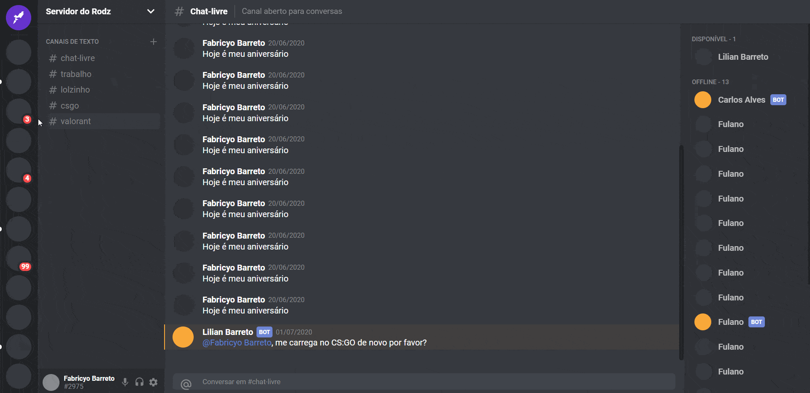

<h1 align="center">
Discord Clone
</h1>

Um simples clone da tela inicial do site Discord.

  

[//]: # (Add your gifs/images here:)

  

## Features
[//]: # (Add the features of your project here:)
Para o desenvolvimento desse projeto foram utilizadas as seguintes tecnologias com práticas de componentização!

- **React Js** — Uma Biblioteca Javascript para construção de interfaces de usuário.
- **Styled Components** — Um pacote para escrever códigos CSS em arquivos Javascript, para estilização das interfaces.

## Getting started

Primeiro faça o clone do repositório:  
    `git clone {url repositório}`   
Entre na pasta do projeto:  
    `cd copy_discord`   
Execute o comando para baixar os pacotes:  
    `yarn` ou `npm`   
Agora inicie o projeto:  
    `yarn start` ou `npm start`   

## License

This project is licensed under the MIT License - see the [LICENSE](https://opensource.org/licenses/MIT) page for details.